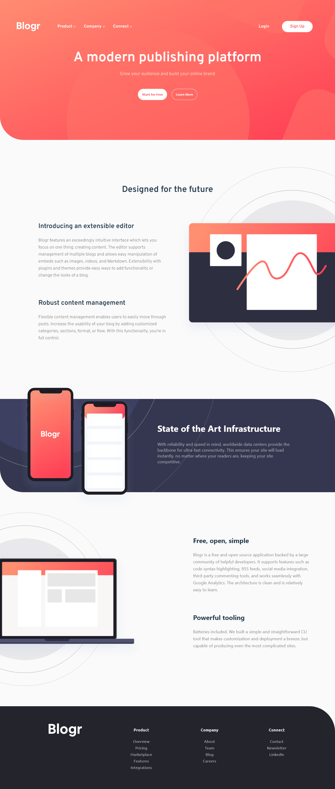

# Frontend Mentor Responsive HTML-CSS-JS - Blogr landing page solution

This is a solution to the [Blogr landing page challenge on Frontend Mentor](https://www.frontendmentor.io/challenges/blogr-landing-page-EX2RLAApP). 

## Table of contents

- [Overview](#overview)
  - [The challenge](#the-challenge)
  - [Screenshot](#screenshot)
  - [Links](#links)
- [My process](#my-process)
  - [Built with](#built-with)
  - [Useful resources](#useful-resources)
- [Author](#author)

## Overview

### The challenge

Users should be able to:

- View the optimal layout for the site depending on their device's screen size
- See hover states for all interactive elements on the page

### Screenshot

### Links

- Live Site URL: [Add live site URL here](https://your-live-site-url.com)
- Solution URL: [Add solution URL here](https://your-solution-url.com)

## My process

### Built with

- Semantic HTML5 markup
- CSS custom properties
- Flexbox
- CSS Grid
- Mobile-first workflow

### Useful resources

This helped me to know how to use different self host fonts in my css. 

- [Use different font faces](https://stackoverflow.com/questions/7018535/use-multiple-custom-fonts-using-font-face) 
- [Access diferent font from static files](https://stackoverflow.com/questions/54753575/how-to-let-static-css-files-access-other-files-such-as-eot-ttf-woff-etc) 
- [Have multiple font weights](https://stackoverflow.com/questions/28279989/multiple-font-weights-one-font-face-query) 

This helped me to work with the background images. 

- [Positioning offset images](https://css-tricks.com/positioning-offset-background-images/) 
- [Work with background img + gradient](https://stackoverflow.com/questions/20549123/css-background-image-with-background-gradient) 

## Author

- Frontend Mentor - [@HugoMoncada](https://www.frontendmentor.io/profile/HugoMoncada)

